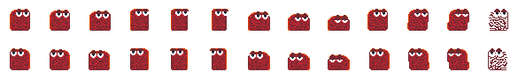

# SlimeRace

+ Version 0.1.0
+ Created By: ImperialOfficer324 and TheBigH11
+ Dependencies: Python 3([Windows](https://www.python.org/downloads/ 'Windows Download for Python')), Pygame(```pip install pygame```)

## Contents
----------------------------------------------------------------
1. [About](#about)
2. [Features](#features)
3. [How to Play](#how-to-play)
5. [Controls](#controls)
6. [Creating Custom Levels](#creating-custom-levels)
7. [Custom Player Appearances](#custom-player-appearances)

## About
-------
SlimeRace is a two-player competitive race platformer where two slimes compete to be the first to reach the gate at the end of the level. The slimes can use freeze or punch attacks to slow and hinder their opponent, while dodging these attacks themselves.

## Features
----------------
+ Slime Appearance Selection and customization
+ Level selection and custom level support
+ Punch and freeze attacks for slimes

## How to Play
------
1. [Starting A Server](#starting-a-server)
2. [Connecting A Client](#connecting-a-client)

At the moment, Slimerace does not have a graphical interface for starting servers or clients. Therefore, they must be started through a terminal.

### Starting A Server
-------------------------------
A server must be run to allow two clients to connect and the race to commence. To start a server, use python 3 to run the file ```source/client.py.```

**Linux**: ```python3 source/server.py```

**Windows**: ```python source\server.py```

You will then be prompted to enter relevant information such as the IP adress and port of the server you wish to start (default values are contained in parentheses and can be used by entering a blank value).

Next you will be prompted to select appearances for the two players. Each of these values should point to the name of a file in the ```assets/players/``` directory (do not include the ```.png``` extension).

The final step is to select a level. Similarly to character appearance, enter the name of a file in the ```levels/``` directory without a file extension.

Your server has been started successfully! Next, connect 2 clients to the server and play the selected level.

### Connecting a Client
----------------------------------------------------------------
After starting a server, the time has come to connect 2 clients. To do this, run the file ```source/client.py``` with python 3.

**Linux**: ```python3 source/client.py```

**Windows**: ```python source\client.py```

Just like with a server, enter the IP and port and the game should start.


## Controls
---
**Movement**: ```wad``` and/or arrow keys(```<^>```)

**Punch Attack**: ```Space```

**Freeze Attack**: ```s``` or down-arrow

## Creating Custom Levels
------
SlimeRace supports custom level building so you can create whatever race you want. However, as of this release no graphical level editor is provided, though that is likely to change in the future.

Even without a level editor, level creation is a fairly simple process. Levels are stored as ```json``` files which can be easily edited. Let's walk through the creation of a level.

**Warning**: While it is possible to edit the default levels, this is discouraged. If you wish to make a change, it is recommended to make a copy of the file.

1. [Setup a File](#step-1-setup-a-file)
2. [The Grid](#step-2-the-grid)
3. [Player Location](#step-3-player-location)

### Step 1: Setup a File
---
The codeblock below contains a basic template for a level. Copy and paste this into a new ```json``` file located in the ```levels``` directory.
```json
{
"grid":[

],
"player_x":0,
"player_y":0
}
```
### Step 2: The Grid
---
```grid``` is a list intended to contain nested lists of integer values. This forms the actual map. Here is an example:

**Example**: ```level1.json```
```json
"grid":[
  [0, 0, 0, 0, 0, 0, 0, 0, 0, 0, 0, 0, 0, 0, 0, 0, 0, 0, 0, 0],
  [0, 0, 0, 0, 0, 0, 0, 0, 0, 0, 1, 1, 0, 0, 0, 0, 0, 0, 0, 1],
  [0, 0, 0, 0, 0, 1, 1, 1, 0, 0, 1, 1, 0, 0, 0, 0, 0, 0, 0, 1],
  [0, 0, 0, 0, 1, 1, 1, 1, 1, 0, 1, 1, 1, 0, 0, 1, 1, 1, 0, 1],
  [1, 1, 1, 0, 1, 1, 1, 0, 1, 0, 1, 0, 1, 1, 0, 0, 1, 0, 0, 1],
  [1, 1, 0, 0, 1, 0, 0, 0, 1, 0, 1, 0, 0, 1, 1, 0, 1, 0, 0, 1],
  [1, 0, 0, 0, 1, 0, 0, 0, 1, 1, 1, 0, 0, 0, 1, 0, 1, 0, 0, 1],
  [0, 0, 0, 0, 0, 0, 0, 0, 0, 1, 0, 0, 0, 0, 0, 0, 1, 0, 0, 1],
  [0, 0, 0, 0, 0, 0, 0, 0, 0, 0, 0, 1, 0, 1, 0, 0, 0, 0, 0, 1],
  [0, 1, 1, 1, 0, 1, 1, 1, 0, 0, 1, 1, 1, 1, 1, 0, 0, 0, 0, 0],
  [0, 1, 1, 1, 0, 1, 1, 1, 1, 0, 1, 1, 1, 1, 1, 1, 1, 0, 0, 0],
  [1, 1, 1, 1, 1, 1, 1, 1, 1, 1, 1, 1, 1, 1, 1, 1, 1, 1, 1, 0],
  [1, 1, 1, 1, 1, 1, 1, 1, 1, 1, 1, 1, 1, 1, 1, 1, 1, 1, 1, 2],
  [1, 1, 1, 1, 1, 1, 1, 1, 1, 1, 1, 1, 1, 1, 1, 1, 1, 1, 1, 1],
  [1, 1, 1, 1, 1, 1, 1, 1, 1, 1, 1, 1, 1, 1, 1, 1, 1, 1, 1, 1]
]
```
Each integer represents a type of tile.

---


**0** represents an empty sky tile that the players can move through

-------


**1** represents a dirt tile that blocks player movement and can be landed on

------


**2** represents the gate that ends the level

------

When crafting levels, always make sure there is at least one path from the player start location to the gate, and make sure to test your level.

### Step 3: Player Location
-----
Where the players start can play a key role in how a level plays. ```player_x``` and ```player_y``` define where the players spawn in. Please note that these values **do not represent tiles**. These are pixel values in the "real-world" scale of the screen.

**Example**: ```level1.json```
```json
"player_x":0,
"player_y":500
```
## Custom Player Appearances


As well as creating custom levels, you can create custom pixel art characters. The easiest way to do this reliably is to copy one of the existing characters and edit that copy, to make sure your frames are all in the correct places. Any player appearances created should be in ```png``` format and located in the ```assets/players``` directory.

**Tip**: The easiest way to create a customized character is to simply change the colors of an existing one

**WARNING**: When running a server with custom appearances, make sure the clients' directories also contain files of the same name.

### Animations
---
**Columns 1-3**: Idle

**Columns 4-6**: Jump

**Columns 7-10**: Land

**Columns 11-13**: Punch

**Column 14**: Frozen
